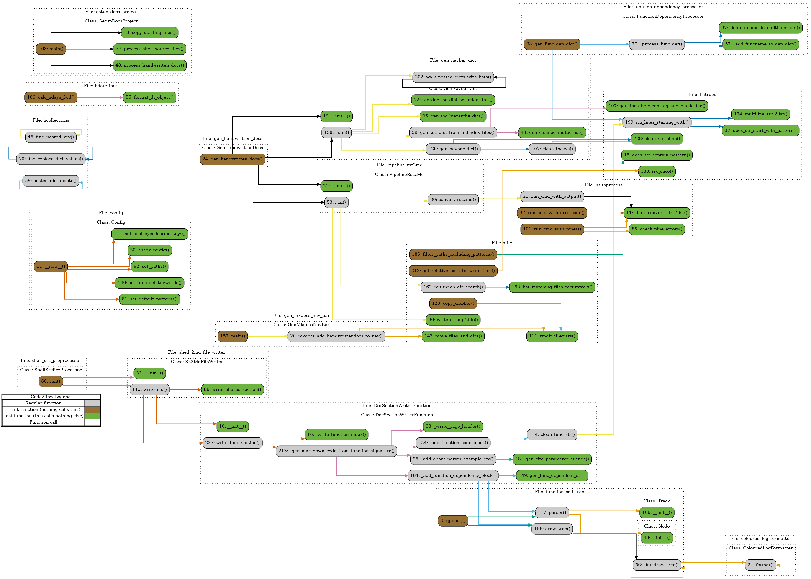

# BASH Auto Doc

[](https://app.deepsource.com/gh/stablecaps/bash-auto-doc/)
[](https://app.deepsource.com/gh/stablecaps/bash-auto-doc/)

[](https://github.com/stablecaps/bash-auto-doc/actions/workflows/test-python-app.yml)

[](https://github.com/stablecaps/bash-auto-doc/actions/workflows/github-repo-stats.yml)

### Broken badges
[](https://python-poetry.org/)
[][PyPI Releases]
[][PyPI Releases]
[][PyPI]
[](https://pypistats.org/packages/poetry)

# This is still a WIP!!!

## Overview
This project is a Python application that uses pip for package management. The main entry point for the application is gen_mkdocs_site.py.

## Getting Started

### Prerequisites
* Python 3.x
* pip

## Installation

```
git clone <repository_url>
cd <project_directory>
python -m venv venv
source venv/bin/activate
pip install -r requirements.txt
```

## Usage
```
# Run program to create mkdocs documentation site and serve it locally.
python gen_mkdocs_site.py --site-confname config/bash_it_site.yaml ---build-serve

# Show help
python gen_mkdocs_site.py --help
```

### Program options
1. `--site_confname` (str): The name of the site configuration.
2. `--build_serve` (bool): Whether to build and serve the local MkDocs site.
3. `--check_singlefile` (str): The path of a single shell source file to debug.
4. `--debug` (bool, optional): If True, debug information will be printed. Defaults to False.


## Program structure

**Auto-Documatix Callgraph:**
__(made with [Code2Flow](https://github.com/scottrogowski/code2flow))__



## Contributing
Please read CONTRIBUTING.md for details on our code of conduct, and the process for submitting pull requests to us.

## License
This project is licensed under the Apache 2.0 License - see the LICENSE.md file for details.

## Things to do still
1. **Setup and Configuration**
    1. use poetry to setup package & standalone app
    2. ~~set up python test coverage (link with deep source)~~
    ~~3. set up pre-commit hooks~~
    4. add create callgen to pre-commit hook
    5. ~~protect master branch~~
    6. package for pip

2. **Documentation**
    1. finish generating docstrings
    2. feed test data into docstrings (run tests on docstrings to check vailidity?)
    3. add contributing.md
    4. create GHA to auto generate BASH documentation for users

3. **Testing**
    1. finish tests using better data sources

4. **Project Management**
    1. write scripts to autogenerate template python repo (cookie-cutter)
    2. add badges
    3. create repo avatar image

5. **Bug Fixes and Improvements**
    1. fix paths so it works with windows - use Pathlib
    ~~2. move undefined md pages to undef category~~
    ~~3. fix orphan single quote on value for about, param, etc~~
    4. Add features to jump to github code file from website
    5. List function calls across files?
    6. List function references across files?
    ~~7. Organise sidebar entries alphabetically~~
    ~~8. Check input config file for errors~~
    7. Process manually written docs
    ~~8. optionally put code generated stuff into a "reference" section~~
    9. Add facility to auto-publish and update hosted github pages
    ~~10. Capitalise title first letter~~
    11. correct "(in ./docs_bash-it/docs/docshw/plugins/available/osx.plugin.bash)" to point at relative repo src file, not temp
    12. embed hyperlinks in function index (currently a code block)
    13. think about putting function names inm navbar? too messy?


6. **Mkdocs**
    1. fix mkdocs search
    ~~2. fix input yaml so it works better with arbitrary mkdocs yaml~~
    ~~3. allow arbitrary mkdocs themes to be used~~

1. **create python documentation website:**
    1. investigate using mkdocstrings
    2. investigate using subsets of callgraph for viz
    3. create GHA to auto generate python documentation for nash-auto-doc repo

8. **Miscellaneous**
    1. amend readme to take into account poetry & also list instructions for standalone binary
    2. rename site to bashautodoc

## Not so Random info links

### Python call graphs
1. [Generating and using a Callgraph, in Python](https://cerfacs.fr/coop/pycallgraph)
2. [Quick & Simple Call Graphs in Python](https://medium.com/parkbee/quick-simple-call-graphs-in-python-eaa583d0e1b2)
    [pyan](https://github.com/Technologicat/pyan)
3. [Build a Call graph in python including modules and functions?](https://stackoverflow.com/questions/13963321/build-a-call-graph-in-python-including-modules-and-functions)
4. [What is a Call Graph? And How to Generate them Automatically](https://www.freecodecamp.org/news/how-to-automate-call-graph-creation/)
5. [Crabviz: a call graph generator for various programming languages](https://www.reddit.com/r/rust/comments/142is0h/crabviz_a_call_graph_generator_for_various/)
6. [**Insane**: Callgraphs with Ghidra, Pyhidra, and Jpype](https://clearbluejar.github.io/posts/callgraphs-with-ghidra-pyhidra-and-jpype/)
